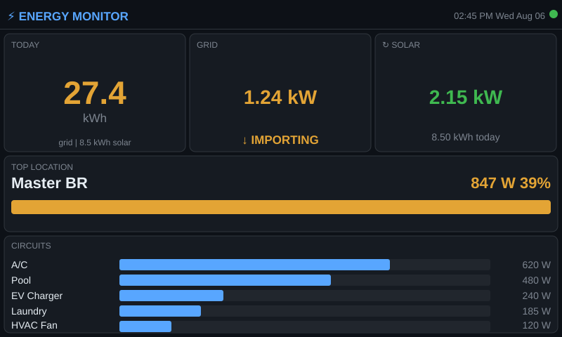

# HA ESP32 Display

ESP32-S3 energy dashboard for Home Assistant. Shows live grid import/export,
solar generation, and per-circuit power draw on a Waveshare 4.3" touchscreen.

**Board**: Waveshare ESP32-S3-Touch-LCD-4.3 — **non-B variant only** (see
[INSTALLATION.md](INSTALLATION.md) for non-B vs B differences).

## What it shows

| Area | Data |
|------|------|
| Top row | Grid kWh imported today · Current net grid watts (import or solar export) · Solar kWh + watts |
| Middle | Highest-draw circuit name and wattage |
| Bottom | Top-5 circuits by current draw, with relative power bars |
| Header | Clock (SNTP), connection status dot |



## Quick start

```powershell
# 1. Clone and open
git clone https://github.com/youruser/ha-energy-display
cd ha-energy-display

# 2. Create secrets for your device
copy devices\main_house\secrets.h.example devices\main_house\secrets.h
# Edit secrets.h — add WiFi SSID/password and HA long-lived token

# 3. Build and flash
.\tools\flash-device.ps1 -Device main_house -Port COM9
```

See [INSTALLATION.md](INSTALLATION.md) for prerequisites and detailed setup.

## Multiple devices

Each board gets its own subdirectory under `devices/`. The build tool selects
one at a time, builds, and flashes it.

```
devices/
  main_house/      ← currently deployed
  garage/          ← future device
  NEW_DEVICE_TEMPLATE/  ← copy this to start a new one
```

To add a board:

1. Copy `devices/NEW_DEVICE_TEMPLATE/` → `devices/<your_name>/`
2. Edit `devices/<your_name>/device_config.h` — set HA host, timezone, and
   circuit entity IDs
3. Copy `secrets.h.example` → `secrets.h` and fill in credentials
4. Update `INFO.md` with location and COM port
5. Flash: `.\tools\flash-device.ps1 -Device <your_name> -Port COM<X>`

## Reflashing an existing device

```powershell
# Put device in boot mode: hold BOOT, tap RESET, release BOOT
# Then run:
.\tools\flash-device.ps1 -Device main_house -Port COM9
```

Or manually (if the script is not available):

```powershell
. C:\esp\esp-idf\export.ps1
python -m esptool --chip esp32s3 -p COM9 -b 460800 --before no_reset `
    write_flash --flash_mode dio --flash_size 16MB --flash_freq 80m `
    0x0 build\bootloader\bootloader.bin `
    0x8000 build\partition_table\partition-table.bin `
    0x10000 build\ha_esp32_display.bin
```

Press **RESET** after flashing to boot normally.

## Monitoring serial output

```powershell
. C:\esp\esp-idf\export.ps1
idf.py -p COM9 monitor
# Press RESET on device to see boot log
# Exit with Ctrl+]
```

> **Windows note:** If `idf.py monitor` gets `PermissionError 13` on the COM
> port, kill stale Python processes first:
> `Stop-Process -Name python -Force -ErrorAction SilentlyContinue`

## Project layout

```
devices/               ← per-device configs (committed except secrets.h)
  main_house/
    device_config.h    ← sensors, circuits, HA host, timezone
    secrets.h          ← GITIGNORED — WiFi + HA token
    secrets.h.example  ← committed template
    INFO.md            ← device notes and circuit table
  NEW_DEVICE_TEMPLATE/ ← copy to create a new device
main/
  board.h/.c           ← non-B board init (RGB LCD, GT911, LEDC backlight)
  ha_client.h/.c       ← HA template API fetch and parse
  ui.h/.c              ← LVGL 9 dashboard
  main.c               ← WiFi, SNTP, poll task
  ha_config.h          ← shim → device_config.h
  device_config.h      ← GITIGNORED — copied from devices/<name>/ by flash script
  secrets.h            ← GITIGNORED — copied from devices/<name>/ by flash script
tools/
  flash-device.ps1     ← select device, build, flash
partitions.csv         ← 2 MB factory slot (binary is ~1.5 MB)
sdkconfig.defaults     ← ESP32-S3, 16 MB flash, octal PSRAM, LVGL fonts
```
